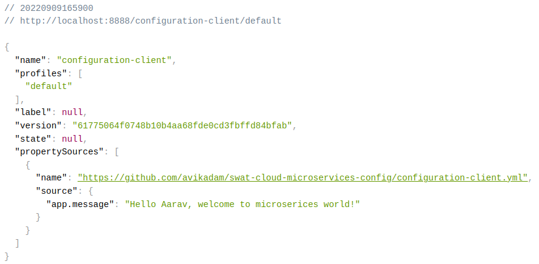

:toc:
:icons: font
:source-highlighter: prettify
:project_id: centralized-configuration

This guide walks you through the process of standing up and consuming configuration from the https://cloud.spring.io/spring-cloud-config/spring-cloud-config.html[Spring Cloud Config Server]

== What You Will Build

You will set up a
https://cloud.spring.io/spring-cloud-config/spring-cloud-config.html[Config Server] and
build a client that consumes the configuration on startup and then _refreshes_ the
configuration without restarting the client.

== What You need
A favorite text editor or IDE

* JDK 1.8 or later

* Gradle 4+ or Maven 3.2+

* You can also import the code straight into your IDE:

** Spring Tool Suite (STS)

** IntelliJ IDEA

[[scratch]]
== Starting with Spring Initializr

:service-link: https://start.spring.io/#!type=maven-project&language=java&platformVersion=2.6.7&packaging=jar&jvmVersion=11&groupId=com.example&artifactId=centralized-configuration-server&name=centralized-configuration-server&description=Demo%20project%20for%20Spring%20Boot&packageName=com.example.centralized-configuration-server&dependencies=cloud-config-server
:client-link: https://start.spring.io/#!type=maven-project&language=java&platformVersion=2.6.7&packaging=jar&jvmVersion=11&groupId=com.example&artifactId=centralized-configuration-client&name=centralized-configuration-client&description=Demo%20project%20for%20Spring%20Boot&packageName=com.example.centralized-configuration-client&dependencies=cloud-config-server,actuator,web

You can use this {service-link}[pre-initialized project] (for the service application) or this {client-link}[pre-initialized project] (for the client application) and click Generate to download a ZIP file. This project is configured to fit the examples in this tutorial.

To manually initialize the project:

. Navigate to https://start.spring.io.
This service pulls in all the dependencies you need for an application and does most of the setup for you.
. Choose either Gradle or Maven and the language you want to use. This guide assumes that you chose Java.
. Click *Dependencies* and select *Config Server* (for the service application) or *Config Client*, *Spring Boot Actuator*, and *Spring Web* (for the client application).
. Click *Generate*.
. Download the resulting ZIP file, which is an archive of a web application that is configured with your choices.

NOTE: If your IDE has the Spring Initializr integration, you can complete this process from your IDE.

NOTE: You can also fork the project from Github and open it in your IDE or other editor.

[[initial]]
== Set up a Config Server

You first need a Config Service to act as a sort of intermediary between your Spring
applications and a (typically) version-controlled repository of configuration files. You
can use Spring Cloud's `@EnableConfigServer` to standup a config server that can
communicate with other applications. This is a regular Spring Boot application with one
annotation added to _enable_ the config server. The following listing (from
`configuration-service/com/tridax/swat/cloud/configuration/service/ConfigurationServiceApplication.java`)
shows such an application:

====
[source,java,tabsize=2]
----
include::./configuration-service/src/main/java/com/tridax/swat/cloud/configuration/service/ConfigurationServiceApplication.java[]
----
====

:git-sample-config-link: https://github.com/avikadam/swat-cloud-microservices-config

The Config Server needs to know which repository to manage. There are several choices
here, but start with a Git-based filesystem repository. You could as easily point the
Config Server to a Github or GitLab repository. On the file system, create a new directory
and run `git init` in it. Then add a file called {git-sample-config-link}[`configuration-client.yml`] to the Git
repository. Then run `git commit` and `git push` in it. Later, you will connect to the Config Server with
a Spring Boot application whose `spring.application.name` property identifies it as
`configuration-client` to the Config Server. This is how the Config Server knows which set of
configuration to send to a specific client. It _also_ sends all the values from any file
named `application.properties` or `application.yml` in the Git repository. Property keys
in more specifically named files (such as `configuration-client.yml`) override those
in `application.properties` or `application.yml`.

Add a simple property and value (`message = Hello world`) to the newly created
`configuration-client.yml` file and then `git commit` and `git push` the change.

Specify the path to the Git repository by specifying the
`spring.cloud.config.server.git.uri` property in
`configuration-service/src/main/resources/application.yml`. You must also specify a
different `server.port` value to avoid port conflicts when you run both this server and
another Spring Boot application on the same machine. The following listing (from
`configuration-service/src/main/resources/application.yml`) shows such an
`application.yml` file:

====
[source,properties]
----
include::./configuration-service/src/main/resources/application.yml[]
----
====

This example uses a a remote git repository (such as Github) at `{git-sample-config-link}[Git Config Repository]`.

== Reading Configuration from the Config Server by Using the Config Client

Now that you have stood up a Config Server, you need to stand up a new Spring Boot
application that uses the Config Server to load its own configuration and that _refreshes_
its  configuration to reflect changes to the Config Server on-demand, without restarting
the JVM. To do so, add the `org.springframework.cloud:spring-cloud-starter-config`
dependency, to connect to the Config Server. Spring sees the configuration property files,
as it would any property file loaded from `application.properties` or `application.yml` or
any other `PropertySource`.

The properties to configure the Config Client can be set up in the usual
way for a Spring Boot application. Specify the client's `spring.application.name` as `configuration-client`
and the location of the Config Server (`spring.config.import`) in
`configuration-client/src/main/resources/application.yml`.

The following listing shows that file:

====
`configuration-client/src/main/resources/application.yml`
[source,java,tabsize=2]
----
include::./configuration-client/src/main/resources/application.yml[]
----
====

You also want to enable the `/refresh` endpoint, to demonstrate dynamic configuration
changes. The listing above shows how to do so via the `management.endpoints.web.exposure.include`
property.

The client can access any value in the Config Server by using the traditional mechanisms
(such as `@ConfigurationProperties` or `@Value("${...}")` or through the `Environment`
abstraction). Now you need to create a Spring MVC REST controller that returns the
resolved `message` property's value.

See the https://spring.io/guides/gs/rest-service/[Building a RESTful Web Service] guide to learn
more about building REST services with Spring MVC and Spring Boot.

By default, the configuration values are read on the client's startup and not again. You
can force a bean to _refresh_ its configuration (that is, to pull updated values from the
Config Server) by annotating the `MessageRestController` with the Spring Cloud Config
`@RefreshScope` and then triggering a _refresh_ event. Also note that `@ConfigurationProperties` is needed in order to refresh the properties. The following listing (from
`configuration-client/src/main/java/com/tridax/swat/cloud/configuration/client/`)
shows how to do so:

*ConfigurationClientApplication.java*
====
[source,java,tabsize=2]
----
include::./configuration-client/src/main/java/com/tridax/swat/cloud/configuration/client/ConfigurationClientApplication.java[]
----
====

*MessageRestController.java*
====
[source,java,tabsize=2]
----
include::./configuration-client/src/main/java/com/tridax/swat/cloud/configuration/client/MessageRestController.java[]
----
====

*PropertyConfiguration.java*
====
[source,java,tabsize=2]
----
include::./configuration-client/src/main/java/com/tridax/swat/cloud/configuration/client/PropertyConfiguration.java[]
----
====

== Test the Application

You can test the end-to-end result by starting the Config Service first and then, once it
is running, starting the client. Visit the client app in the browser at
`http://localhost:8080/message`. There, you should see `Hello world` in the response.

Change the `message` key in the `a-bootiful-client.properties` file in the Git repository
to something different (`Hello Spring!`, perhaps?). You can confirm that the Config Server
sees the change by visiting `http://localhost:8888/configuration-client/default`.

You need to invoke the `refresh` Spring Boot Actuator endpoint in order to force the client to refresh
itself and draw in the new value. Spring  Boot's Actuator  exposes operational endpoints
(such as health checks and environment information) about an application. To use it, you
must add `org.springframework.boot:spring-boot-starter-actuator` to the client
application's classpath. You can invoke the  `refresh` Actuator endpoint by sending an
empty HTTP `POST` to the client's `refresh` endpoint:
`http://localhost:8080/actuator/refresh`. Then you can confirm it worked by visting the
`http://localhost:8080/message` endpoint.

The following command invokes the Actuator's refresh command:

====
[source,bash]
----
$ curl localhost:8080/actuator/refresh -d {} -H "Content-Type: application/json"
----
====

NOTE: We set `management.endpoints.web.exposure.include=*` in the client application to
make this is easy to test (since Spring Boot 2.0, the Actuator endpoints are not exposed
by default). By default, you can still access them over JMX if you do not set the flag.

== Summary

Congratulations! You have just used Spring to centralize configuration for all of your
services by first standing up a service and then dynamically updating its configuration.

== See Also

The following guides may also be helpful:

* https://spring.io/guides/gs/rest-service/[Building a RESTful Web Service]
* https://spring.io/guides/gs/spring-boot/[Building an Application with Spring Boot]
* https://spring.io/guides/gs/multi-module/[Creating a Multi Module Project]